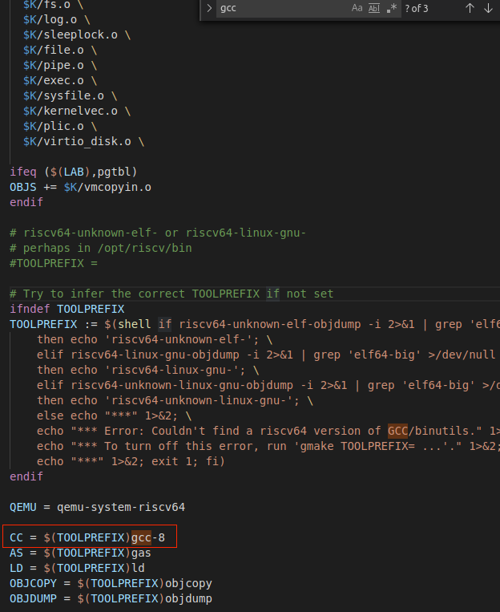

环境说明：Windows VMWare 中安装 18.04.5 版本的 Ubuntu 虚拟机。

## 安装 Ubuntu

[VMWare 安装 Ubuntu 18.04](https://zhuanlan.zhihu.com/p/38797088)。

安装完成后可能会出现 `please remove the install medium then reboot`，按以下步骤：关闭虚拟机 --> 取消 **启动时连接** 勾选 --> 重启虚拟机。

随后可以安装上文推荐链接，更换 apt 源以及安装 vmware tools。

- 更换 apt 源：加快包的下载，可选阿里源。
- 安装 vmware tools：虚拟机适配屏幕分辨率，可从宿主机复制文件至虚拟机。

最后安装 VScode 和 Chrome 浏览器，Chrome 可能无法直接点击 install 安装，通过命令行 `sudo dpkg -i ./google...deb` 即可。

## 搭建 xv6-labs-2020 环境

- [Tools Used in 6.S081](https://pdos.csail.mit.edu/6.828/2020/tools.html)：构建 xv6，需要预先安装工具。

- [Lab: Xv6 and Unix utilites](https://pdos.csail.mit.edu/6.828/2020/labs/util.html)：按照该说明 clone 项目以及构建运行 xv6，过程中可能涉及一些问题下面说明。

首先根据 Installing via Apt 部分安装包，然后进入 xv6 项目中运行 make qemu，可能会出现下列一些问题：

### riscv64-linux-gnu-gcc: error: unrecognized command line option ‘-mno-relax’; did you mean ‘-Wno-vla’?

根据 [相关 issue 给出解决方法](https://github.com/mit-pdos/xv6-riscv/issues/7)，需要使用的 `riscv64-linux-gnu-gcc`，按照[该步骤](https://zoomadmin.com/HowToInstall/UbuntuPackage/gcc-8-riscv64-linux-gnu)安装相应的包，然后编辑 Makefile 文件，改用 `riscv64-linux-gnu-gcc-8`：

### qemu-system-riscv: command not found

- 执行命令 `sudo apt-get install autoconf automake autotools-dev curl libmpc-dev libmpfr-dev libgmp-dev gawk build-essential bison flex texinfo gperf libtool patchutils bc zlib1g-dev libexpat-dev`。

- 在 https://download.qemu.org/qemu-5.1.0.tar.xz 下载 qemu 压缩文件，然后解压缩，进入 `qemu-5.1.0`，执行 `./configure --disable-kvm --disable-werror --prefix=/usr/local --target-list="riscv64-softmmu"`，会出现无法找到 `glib-2.48 gthread-2.0 is required to compile QEMU` 等问题，根据提示安装对应包，然后再重新执行命令即可。[该文中查阅 glib2 的安装](https://blog.csdn.net/nancygreen/article/details/12261601)，从而学会 `apt-cache search` 搜索，缺失的 `pixman` 可通过相同方式搜索并安装。

上述问题解决完后，再执行 make qemu，就可以顺利启动 xv6 内核。