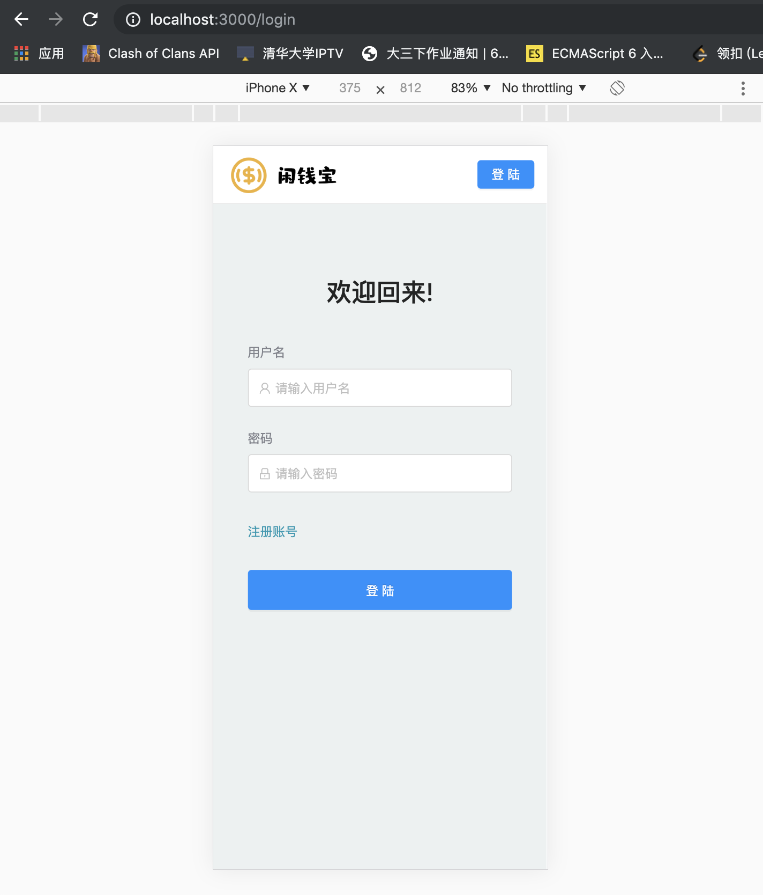

## Docker容器化

## nginx配置

编写nginx配置文件

- 开启了gzip压缩资源，减小带快，加快资源加载
- 开启零拷贝
- 静态资源响应
- api请求转发

```
# 开启gzip
gzip on;

# 启用gzip压缩的最小文件，小于设置值的文件将不会压缩
gzip_min_length 1k;

# gzip 压缩级别，1-10，数字越大压缩的越好，也越占用CPU时间，后面会有详细说明
gzip_comp_level 2;

# 进行压缩的文件类型。javascript有多种形式。其中的值可以在 mime.types 文件中找到。
gzip_types text/plain application/javascript application/x-javascript text/css application/xml text/javascript image/jpeg image/gif image/png;

# 是否在http header中添加Vary: Accept-Encoding，建议开启
gzip_vary on;

# 禁用IE 6 gzip
gzip_disable "MSIE [1-6]\.";

server {
  # 监听80端口
  listen       80;
  server_name  localhost;

  # 开启零拷贝
  sendfile     on;

  # 将请求代理至指定地址的3000端口，该koaserver变量将在docker-compose.yml文件指定
  location / {
    proxy_pass http://koaserver:3000;
  }

  # 将路径包含/static/的请求用/app/static/下的资源进行响应
  # 例如http://localhost/static/vendor.js 将 变成http://localhost/app/static/vendor.js
  location /static/ {
    alias /app/static/;
    expires 7d;
  }

  # 代理api请求
  # 例如http://localhost/api/user 将被代理至 http://host.docker.internal:4000/user
  # host.docker.internal为mac中docker的宿主机地址
  location ^~/api/ {
    rewrite ^/api/(.*)$ /$1 break;
    proxy_pass http://host.docker.internal:4000;
  }

  location = /50x.html {
    root   /usr/share/nginx/html;
  }
}

```

编写nginx环境的container相关Dockerfile：

- 获取nginx镜像
- 将项目中打包好的dist文件夹拷贝到容器中的app文件夹中（因此nginx配置文件的静态资源路径是/app/static/）
- 拷贝nginx配置文件

```js
FROM nginx
COPY dist/ /app
COPY nginx/default.conf /etc/nginx/conf.d/default.conf

```

## node服务端配置

因为项目中采用的是服务端渲染技术，即要在客户端和api服务器之间设置一个node中间层进行页面请求的响应，因此要启一个node服务，和往常SPA不同，SPA只要用nginx环境代理即可。

Dockerfile配置

```js
FROM node
COPY . /app
```

## docker-compose.yml配置

配置文件指明启动两个容器，每个容器有各自的Dockerfile，当我们访问localhost:3000端口将会访问到nginx容器中的80端口，而我的配置文件将80端口的请求转发到koaserver:3000，其中koaserver链接到了node容器中，即指向node容器的地址。

```js
version: "3"

services:
  nginx:
    build:
      context: .
      dockerfile: nginx/Dockerfile
    ports:
      - 3000:80
    links:
      - web:koaserver
  web:
    build:
      context: .
      dockerfile: server/Dockerfile
    working_dir: /app
    command: [ "npm", "start" ]

```

## 启动

在package.json中添加一下字段，方便后续打包和快速启动docker

```js
"script": {
  //...
  "build:docker": "docker-compose up --build",
  "docker": "docker-compose up"
  //...
}
```

在cmd中输入:

```
npm run build:docker
```

即可构建和启动docker。

启动成功后，浏览器进入localhost:3000，看到一下页面：



## 最后

[相关项目地址](https://github.com/earnsparemoney/frontend)

#### Docker常用命令记录

- [阿里云镜像](https://cr.console.aliyun.com/cn-hangzhou/instances/mirrors): 加速镜像下载
- docker stop $(docker ps -a -q): 停止所有container
- docker rm $(docker ps -a -q): 删除所有container
- docker rmi $(docker images -q): 删除所有image