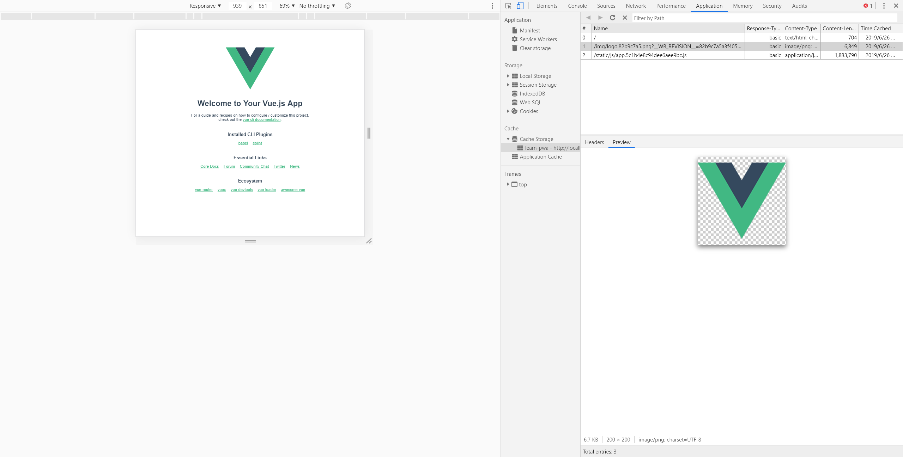
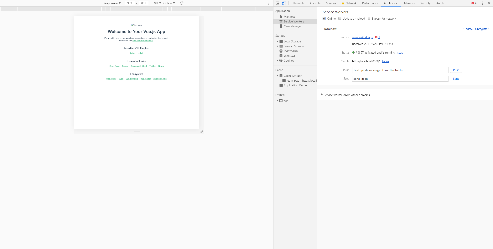
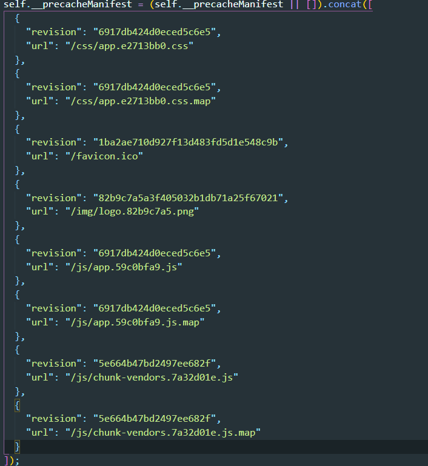
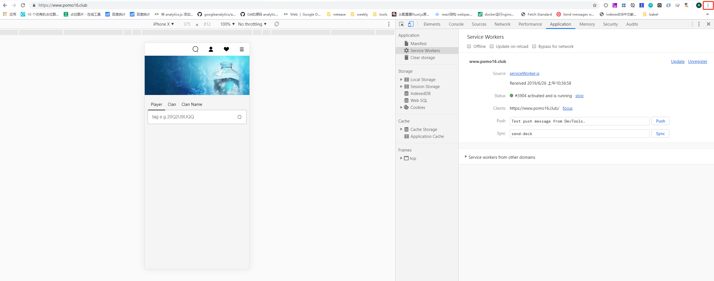

# 渐进式Web应用PWA

PWA全称Progressive Web Application，即渐进式Web应用。它能将该网站所需要的静态资源（如：js、css、image）缓存下来，在往后用户访问该网站的时候，浏览器就能够从缓存中读取相应资源，从而加快启动速度，甚至在无网络的情况下，也能正确呈现页面，而不是熟悉的404页面。


## 使用workbox插件集成到Vue CLI中

下面配置属于一些基础配置，对每个项目可能都需要不同的策略对资源进行缓存，并且做一些功能的实现。

如果想了解清楚以下配置的原理，需要对原生实现进行了解，并对Service Worker生命周期等有一定认识，workbox只是对这些原生实现进行了一些高级封装，使用起来更加方便而已。推荐阅读：

- [Service Worker介绍](<https://developers.google.com/web/fundamentals/primers/service-workers/?hl=zh-cn>)
- [workbox指南](<https://developers.google.com/web/tools/workbox/guides/get-started>)

对于Service Worker进一步使用

- [了解indexDB](https://www.tangshuang.net/3735.html)
- [sync manager](https://developers.google.com/web/updates/2015/12/background-sync)

Vue CLI生成的项目有提供pwa插件便于快速生成pwa应用，但是它开发时是关闭pwa功能的，因此选择自行配置workbox环境。

```js
// 创建项目
vue create learn-pwa

// 安装workbox插件
cd learn-pwa
cnpm i workbox-webpack-plugin -D
```

根目录下创建`vue.config.js`，引入workbox-webpack-plugin。

```js
const path = require('path')
const workboxPlugin = require('workbox-webpack-plugin')

function resolve (dir) {
  return path.join(__dirname, dir)
}

const workboxOptions = {
  swSrc: resolve('src/sw/serviceWorker.js'),
  swDest: 'serviceWorker.js'
}

module.exports = {
	configureWebpack: (config) => {
		config.plugins.push(
          new workboxPlugin.InjectManifest(workboxOptions)
        )
	}
}
```

创建`src/sw/serviceWorker.js`，下面会介绍每一步的大概作用。

```js
const runtimeCacheName = 'learn-pwa'
workbox.core.setCacheNameDetails({
  prefix: '',
  suffix: '',
  precache: runtimeCacheName,
  runtime: runtimeCacheName
})

// 安装完成跳过wait节点
workbox.core.skipWaiting()

// 安装完成掌握控制权
workbox.core.clientsClaim()

// 预缓存
workbox.precaching.precache(['/'].concat(self.__precacheManifest))

workbox.routing.registerRoute(
  '/',
  new workbox.strategies.NetworkFirst()
)

workbox.routing.registerRoute(
  /\.(js|css)$/,
  new workbox.strategies.CacheFirst({
    cacheName: runtimeCacheName
  })
)
```

在`main.js`中添加注册service worker的代码。

```js
/* eslint-disable no-console */
if ('serviceWorker' in navigator) {
  window.addEventListener('load', () => {
    navigator.serviceWorker.register('/serviceWorker.js').then(registration => {
      console.log('SW registered: ', registration)
    }).catch(registrationError => {
      console.log('SW registration failed: ', registrationError)
    })
  })
}
```

运行项目:

```js
npm run serve
```

打开chrome浏览器 > 进入chrome dev tools > Application > Cache Storage可以看到以下结果：



右边缓存列表是service worker预缓存的资源。此时点击dev tools中的Serivce Workers或Network的Offline选项，再刷新页面，可以看到并不会返回404：



## 介绍serviceWorker.js中各部分的作用

```js
const runtimeCacheName = 'learn-pwa'
workbox.core.setCacheNameDetails({
  prefix: '',
  suffix: '',
  precache: runtimeCacheName,
  runtime: runtimeCacheName
})
```

这一部分是设置workbox在Cache Storage中存储资源的名称，从上面运行结果可以看到名称就是我们指定的`learn-pwa`，默认情况下precache和runtime的名称是分开的，具体可参考[workbox指南](<https://developers.google.com/web/tools/workbox/guides/get-started>)。precache中存储的是service worker在安装时预缓存的内容，runtime存储的是页面运行过程中网络请求结果（如果有对相应url进行workbox注册的话）。将这两者命名为同一个名称的原因是，precache中通常会预缓存打包出来的js、css文件，这些文件我们希望使用CacheFirst的策略进行响应（因为有哈希码，无需担心缓存问题），而使用CacheFirst的时候必须指明一个cacheName，如果js、css存储的cacheName和precacheName不一致，就会导致多余的缓存；并且如果不一致，第一次访问页面且预缓存之后，离线再刷新会返回404，因为此时js、css对应的cache中还没有缓存（service worker第一次安装时还没有获得控制权时，js、css文件已经开始请求，因此触发runtime cache）。

```js
// 安装完成跳过wait节点
workbox.core.skipWaiting()

// 安装完成掌握控制权
workbox.core.clientsClaim()
```

从 Service Worker 生命周期可以知道，新的Service Worker安装完成之后会处于waiting状态，页面仍然由旧的 service worker 进行管理，调用`skipWaiting()`就是跳过这个waiting，让新的service worker替代旧的。当访问一个网站时，该网站没有service worker的话，即便在访问过程中service worker安装完成，控制权依然不是属于service worker的，调用`clientsClaim()`可以立刻取得页面控制权，对后续网络资源进行处理。

```js
workbox.precaching.precache(['/'].concat(self.__precacheManifest))
```

调用`precache`并将`self.__precacheManifest`可以将webpack打包出来的资源进行预缓存。

```
npm run build
```

构建完成后，我们可以看到dist文件夹有个precache-manifest.json文件，内容大体如下：



熟悉webpack可以很清楚的看到，这些文件就是webpack打包出来的资源，都存在dist文件夹中。通常我们不需要map文件，这部分可以在vue.config.js中相关workbox配置中添加exclude指明，详情见[workbox指南](<https://developers.google.com/web/tools/workbox/guides/get-started>)：

```js
const workboxOptions = {
  swSrc: resolve('src/sw/serviceWorker.js'),
  swDest: 'serviceWorker.js',
  exclude: [/index\.html/, /\.map/]
}
```

关于预缓存剩下一个问题就是，我将index.html文件排除了，并在service worker中的预缓存数组中添加了`'/'`，这是因为用户访问网站通常时www.example.com，而不是www.example.com/index.html，这样即使预缓存了index.html，离线后如果用户访问www.example.com发起的并不是对index.html的请求，因此不会获得正确响应。

```js
workbox.routing.registerRoute(
  '/',
  new workbox.strategies.NetworkFirst()
)

workbox.routing.registerRoute(
  /\.(js|css)$/,
  new workbox.strategies.CacheFirst({
    cacheName: runtimeCacheName
  })
)
```

要注意一点，并不是预缓存了资源离线就可以得到响应，必须使用workbox进行路由注册，这和原生实现是一个道理，你必须监听fetch请求并对对应的请求进行respondWith才可以，workbox.routing.registerRoute就是对这些做了一层封装。


## 添加manifest.json使应用变得可安装

**注意：上线的应用要使用PWA功能，必须是HTTPS的**

如果是vue cli 3.0创建的应用，请在public文件夹中创建manifest.json

```json
{
  "shortname": "Clash Royale",
  "name": "Clash Royale",
  "description": "For CR Lover",
  "start_url": "/",
  "scope": "/",
  "display": "standalone",
  "icons": [
    {
      "src": "/static/images/cards/baby-dragon.png",
      "type": "image/png",
      "sizes": "192x192"
    }
  ],
  "theme_color": "#2185d0",
  "background_color": "#2185d0",
}
```

这个manifest.json文件内容只是给出参考，每个字段都可能有不同配置，不赘述每个字段的意义。想体验安装过程可以访问我的PWA网站:

- www.pomo16.com（皇室战争数据查询）

安卓手机用chrome访问后，会自动弹出安装按钮。

苹果手机需要使用Safari浏览器，然后点击分享按钮，选择添加到主屏幕。

电脑使用chrome访问，点击右上角设置，选择安装'Clash Royale'。




## 最后

使用PWA还伴随着很多功能，例如可以使用Sync Manager进行后台请求，配合indexDB可以提升很多用户体验，但这些功能浏览器支持程度还比较低。

我们的挣闲钱项目也会支持基本的PWA功能。
